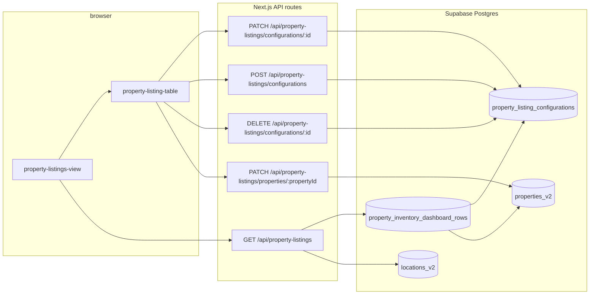

# Internal property inventory dashboard — technical documentation

This document describes the **ops / internal inventory** feature: the UI at `/ca-internal-inventory-v1`, how it talks to the backend, how data is stored in Postgres (Supabase), and how pieces connect. It is intended for engineers maintaining or extending the system.

---

## 1. Purpose and scope

- **What it is:** An internal, Excel-style view of **published** projects. Each **project** (`properties_v2`) can have many **configuration lines** (e.g. 2 BHK + sq ft + price in Cr) stored in `property_listing_configurations`.
- **What it is not:** It does not replace the public property CMS. Header fields **Towers** and **Possession** write to `properties_v2` (`inventory_towers`, `possession_date`) and therefore overlap with fields used elsewhere in the app.
- **Indexing:** The page route sets `robots: noindex` in metadata; treat the URL as private (still protect with network / auth as needed).

---

## 2. Route and page shell

| Item | Location |
|------|----------|
| Next.js page | `app/ca-internal-inventory-v1/page.tsx` |
| Client UI root | `components/property-listings/property-listings-view.tsx` |
| Table / cards | `components/property-listings/property-listing-table.tsx` |
| Loading skeleton | `components/property-listings/property-listings-skeleton.tsx` |

The page exports:

- `dynamic = "force-dynamic"` and `revalidate = 0` so HTML is not statically cached.
- Strong `robots` metadata to discourage crawling.

The view intentionally **does not** render the global `Header` / `Footer` (full-bleed internal tool layout).

---

## 3. High-level data flow

1. **Load:** `PropertyListingsView` fetches `GET /api/property-listings?page=&perPage=` → JSON `items` + `pagination` + `editModeAvailable`.
2. **Render:** `PropertyListingTable` groups contiguous rows by `propertyId` and renders one **card** per project; each card shows header fields + inner table of lines.
3. **Save:** On **Save**, the client first **PATCH**es property header (`inventoryTowers`, `possessionDate`), then for each draft line either **PATCH**es (existing id + price), **POST**s (new line with price), or **DELETE**s (persisted line with empty price).

---

## 4. Database model

### 4.1 Table: `property_listing_configurations`

Defined in `sql/property_listing_configurations.sql` (clean install) and used directly by write APIs.

| Column | Type | Purpose |
|--------|------|---------|
| `id` | UUID PK | Line id; exposed to UI as `PropertyInventoryRow.id` |
| `property_id` | UUID FK → `properties_v2.id` ON DELETE CASCADE | Parent project |
| `configuration` | TEXT | Label (e.g. “2 BHK”) |
| `size_sqft` | TEXT | Super area; stored as text; app validates digits when non-empty |
| `price_cr` | TEXT | Price in Cr; digits-only when non-empty |
| `sort_order` | INTEGER | Ordering within a project |
| `created_at` | TIMESTAMPTZ | Audit |
| `updated_at` | TIMESTAMPTZ | Maintained by trigger |

**RLS:** Enabled on the table; the app uses the **Supabase service role** via `getSupabaseAdminClient()` for server-side reads/writes, bypassing RLS for these routes.

**Indexes:** `property_id`, and `(property_id, sort_order, id)` for listing lines per project.

### 4.2 Table: `properties_v2` (relevant columns)

The dashboard reads most display fields from the view join; writes for header:

| Column | Purpose |
|--------|---------|
| `id` | Property id |
| `is_published` | View and APIs only include **published** rows |
| `slug`, `project_name`, `location`, `location_id`, `locality_id` | Display + URLs |
| `hero_image`, `hero_image_alt` | Thumbnail |
| `created_at` | Used to sort **projects** (newest first) |
| `possession_date` | TEXT; shown/edited as “Possession” (free text) |
| `inventory_towers` | TEXT; ops tower count; **added** by inventory SQL (`ALTER TABLE ... IF NOT EXISTS`) |

`possession_date` is shared with the wider property model (e.g. admin forms); changing it here updates the same column.

### 4.3 View: `property_inventory_dashboard_rows`

Flattened read model for the GET API:

- **FROM** `properties_v2` **p**
- **LEFT JOIN** `property_listing_configurations` **c** ON `c.property_id = p.id`
- **WHERE** `p.is_published = true`

Selected columns include line fields (`line_id` = `c.id`, **null when the project has no configuration rows yet**), `property_id` = `p.id`, `configuration_label`, `size_sqft`, `price_cr`, `sort_order`, … and property fields (`slug`, `project_name`, `location` as `location_label`, `hero_image`, `possession_date`, `inventory_towers`, `property_created_at`, …).

**Important:** Every **published** project appears at least once (one row with `line_id` null if there are no PLC rows). The seed/repair SQL can still insert a blank `property_listing_configurations` row for projects with zero rows so edits use real UUID line ids sooner.

### 4.4 Table: `locations_v2`

After fetching dashboard rows, `GET /api/property-listings` loads `locations_v2.id → slug` for distinct `location_id` values on the current page, and sets `PropertyInventoryRow.locationSlug` for building public property URLs.

---

## 5. SQL scripts (operations)

| File | When to use |
|------|-------------|
| `sql/property_listing_configurations.sql` | **Clean install:** drops/recreates table + view, adds `inventory_towers` on `properties_v2`, seeds blank lines for published properties. **Destructive** to existing `property_listing_configurations` data. |
| `sql/inventory_dashboard_header_migration.sql` | **Incremental:** if an older DB already had inventory without `inventory_towers` / view columns — adds column and recreates the view. |
| `sql/inventory_dashboard_all_published.sql` | **Incremental:** recreates the dashboard view so **all published** `properties_v2` rows appear (LEFT JOIN PLC; `line_id` null when no lines). |
| `sql/inventory_repair_missing_configuration_rows.sql` | **Repair:** `INSERT` one empty configuration row per published property that has **zero** rows (optional; UI/API already handle null `line_id`). Idempotent. |

After schema changes in Supabase, reload the API schema if PostgREST does not see new tables/columns immediately.

---

## 6. Backend: API routes

All paths are under `app/api/property-listings/`.

### 6.1 `GET /api/property-listings`

**File:** `app/api/property-listings/route.ts`

- **Auth:** None (rate-limited as `RATE_LIMITS.PUBLIC`).
- **Query:** `page` (default 1), `perPage` (default 10, max 50).
- **Data source:** `property_inventory_dashboard_rows`, ordered by `property_created_at` desc, then `property_id`, `sort_order`, `line_id`.
- **Cap:** Up to 15,000 lines read before grouping (safety limit); 10s query timeout.
- **Pagination:** Server groups rows by `property_id` **in first-seen order**, then paginates **projects** (not raw lines). Each line on the page gets a `propertySerial` (1-based index within the full sorted project list for the current page slice).
- **Response:**
  - `items: PropertyInventoryRow[]`
  - `pagination: { page, perPage, totalProperties, totalPages }`
  - `editModeAvailable: boolean` — `true` iff `PROPERTY_LISTINGS_EDIT_SECRET` is set in the server environment.

**Headers:** `Cache-Control: private, no-store`, `X-Content-Type-Options: nosniff`.

### 6.2 `PATCH /api/property-listings/properties/[propertyId]`

**File:** `app/api/property-listings/properties/[propertyId]/route.ts`

- **Auth:** `PROPERTY_LISTINGS_EDIT_SECRET` must match either header `X-Ca-Property-Listings-Edit-Key` or `Authorization: Bearer <secret>` (`lib/property-listings-edit-auth.ts`).
- **Body:** `{ inventoryTowers?: string, possessionDate?: string }` (parsed with max lengths; towers digits-only when non-empty).
- **Effect:** Updates `properties_v2.inventory_towers` and `possession_date` (null if possession empty string) for the given **published** property.

### 6.3 `POST /api/property-listings/configurations`

**File:** `app/api/property-listings/configurations/route.ts`

- **Auth:** Same as above.
- **Body:** `{ propertyId, configuration, sizeSqft, priceCr }` — **price required**, digits only; size digits-only if non-empty.
- **Effect:** Inserts a new row with `sort_order` = max existing + 1. Returns `{ item: PropertyInventoryRow }` loaded from the view (optional client use).

### 6.4 `PATCH /api/property-listings/configurations/[id]`

**File:** `app/api/property-listings/configurations/[id]/route.ts`

- **Auth:** Same.
- **Body:** `{ configuration, sizeSqft, priceCr }` — **price required** for PATCH, digits only; size validated as digits-or-empty.
- **Effect:** Updates the line if its parent property is published.

### 6.5 `DELETE /api/property-listings/configurations/[id]`

**File:** Same as PATCH handler.

- **Auth:** Same.
- **Behavior:**
  - If more than one line exists for that `property_id`: **delete** the row.
  - If only **one** line remains: **no delete** — the row is **cleared** (`configuration`, `size_sqft`, `price_cr` empty, `sort_order` 0) so the project **stays** in the dashboard view.

### 6.6 Other routes under `/api/property-listings/`

- `app/api/property-listings/[id]/route.ts` — PATCH legacy property fields (`priceMin`, `priceMax`, etc.) on `properties_v2`; **not** used by the internal inventory dashboard UI described here.
- `locations`, `localities`, `property-types` — support other listing experiences; the inventory page uses **GET** + **configurations** + **properties** PATCH only.

---

## 7. Shared libraries

| File | Role |
|------|------|
| `lib/property-listings-edit-auth.ts` | Validates edit secret from header or Bearer token. |
| `lib/property-listings-edit-headers.ts` | `propertyListingsEditFetchHeaders(token)` — sets `X-Ca-Property-Listings-Edit-Key` and `Authorization: Bearer` for browser `fetch`. |
| `lib/property-listings-price.ts` | `sanitizeInventoryDigitsInput`, `isValidInventoryPriceDigits`, `isValidInventoryDigitsOrEmpty` — shared client/server rules for numeric text fields. |
| `lib/supabase-server.ts` | `getSupabaseAdminClient()` — service role client used by all inventory API routes. |

---

## 8. Types (frontend contract)

**File:** `types/property-listing.ts`

`PropertyInventoryRow` is the shape of each **line** in `GET` `items` (with duplicates of property-level fields per line for the same `propertyId`):

- Line: `id`, `configuration`, `sizeSqft`, `priceCr`, `sortOrder`
- Property: `propertyId`, `slug`, `projectName`, `locationLabel`, `locationId`, `localityId`, `heroImage`, `heroImageAlt`, `inventoryTowers`, `possessionDate`, `locationSlug`
- UI: `propertySerial` (optional) — display index for the project on the current page

---

## 9. Frontend behavior (summary)

### 9.1 `PropertyListingsView`

- Fetches paginated list; stores `editKey` in `sessionStorage` under `ca_private_pl_edit_key` when the user unlocks.
- Passes `editKey` to `PropertyListingTable`; passes `null` when locked or when `editModeAvailable` is false.
- Uses `PropertyGridPagination` when `totalPages > 1`.

### 9.2 `PropertyListingTable`

- Groups items by contiguous `propertyId`.
- Each **card** keeps **draft** state for configuration lines + header towers/possession; syncs from props when server data changes.
- **Preset configurations:** `lib/property-enums` `CONFIGURATIONS` rotates suggestions for new blank rows.
- **Save pipeline:** `PATCH .../properties/:propertyId` then per-row PATCH/POST/DELETE as described in §3.
- **Validation UX:** Digits-only sanitization for price, size, towers; possession free text (max length enforced in UI and API).

---

## 10. Environment variables

| Variable | Used by | Purpose |
|----------|---------|---------|
| `PROPERTY_LISTINGS_EDIT_SECRET` | API routes + GET response flag | If unset: write endpoints return 503; GET sets `editModeAvailable: false`. If set: must be sent as edit key to mutate data. |
| Supabase service role env vars | `getSupabaseAdminClient()` | Server-only DB access (standard project setup). |

Never expose the edit secret in client bundles; only the **presence** of the secret is reflected as `editModeAvailable`. The actual key is entered by the user and kept in `sessionStorage` for convenience.

---

## 11. Operational notes

- **Projects missing from UI:** Usually means **no** `property_listing_configurations` rows for that published property — run `sql/inventory_repair_missing_configuration_rows.sql`.
- **Schema errors on GET:** Ensure the view exists and includes columns expected by `DashboardViewRow` in `route.ts` (run main or migration SQL).
- **401 on save:** Mismatch between client key and `PROPERTY_LISTINGS_EDIT_SECRET`, or missing Bearer/header (see `property-listings-edit-headers.ts`).

---

## 12. File checklist (dashboard-specific)

| Area | Paths |
|------|--------|
| Page | `app/ca-internal-inventory-v1/page.tsx` |
| UI | `components/property-listings/property-listings-view.tsx`, `property-listing-table.tsx`, `property-listings-skeleton.tsx` |
| GET list | `app/api/property-listings/route.ts` |
| Writes | `app/api/property-listings/configurations/route.ts`, `configurations/[id]/route.ts`, `properties/[propertyId]/route.ts` |
| Types | `types/property-listing.ts` |
| Auth / validation | `lib/property-listings-edit-auth.ts`, `lib/property-listings-edit-headers.ts`, `lib/property-listings-price.ts` |
| Schema | `sql/property_listing_configurations.sql`, `sql/inventory_dashboard_header_migration.sql`, `sql/inventory_repair_missing_configuration_rows.sql` |

This README reflects the inventory dashboard as implemented in this repository; if you add filters, auth middleware, or new columns, update this document in the same PR.
